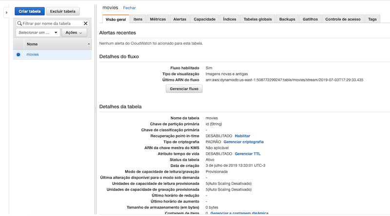
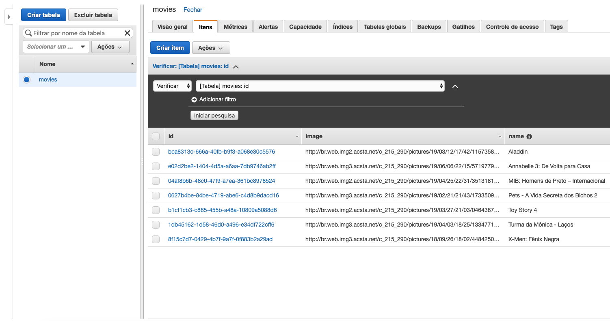
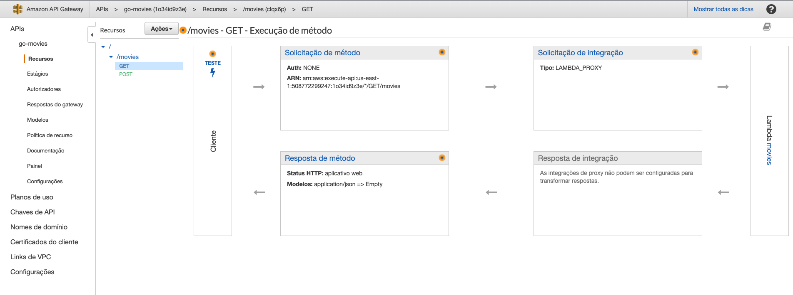
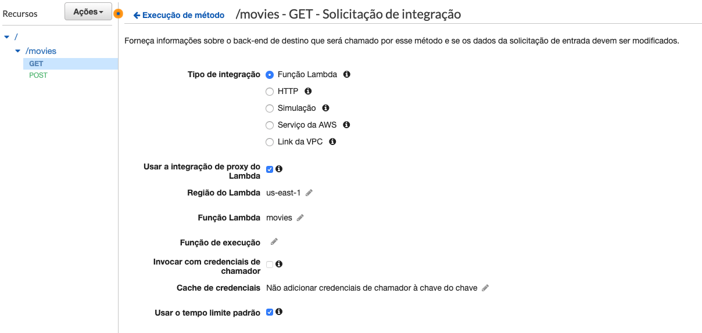
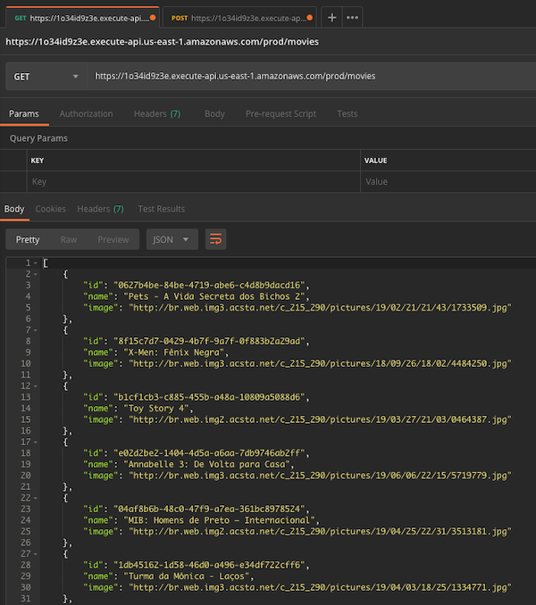
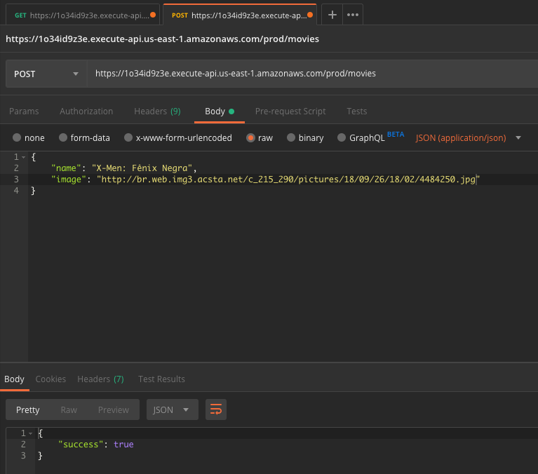

# API de Filmes
Exemplo de uma API de filmes escrita em *Golang* usando os servicos [API Gateway](https://aws.amazon.com/pt/api-gateway/), [Lambda](https://aws.amazon.com/pt/lambda/) e [DynamoDB](https://aws.amazon.com/pt/dynamodb/).

## DynamoDB
Criar uma tabela chamada `movies` com os campos `id`, `name` e `image`:





## Lambda
Criar uma funcao Lambda chamada `movies`:

Para compilar e zipar os arquivos do projeto usar os comandos:

```
env GOOS=linux go build -o main
zip main.zip main
```

## API Gateway

Criar uma API com o recurso `movies` e os métodos `GET` e `POST`:



Integracao com o Lambda:



## Testando
Recuperando lista de filmes:



Inserindo um novo filme:



## Créditos
[https://medium.com/iq360/go-serverless-construindo-uma-api-usando-golang-e-aws-lambda-2a7d6a3019b9](https://medium.com/iq360/go-serverless-construindo-uma-api-usando-golang-e-aws-lambda-2a7d6a3019b9)